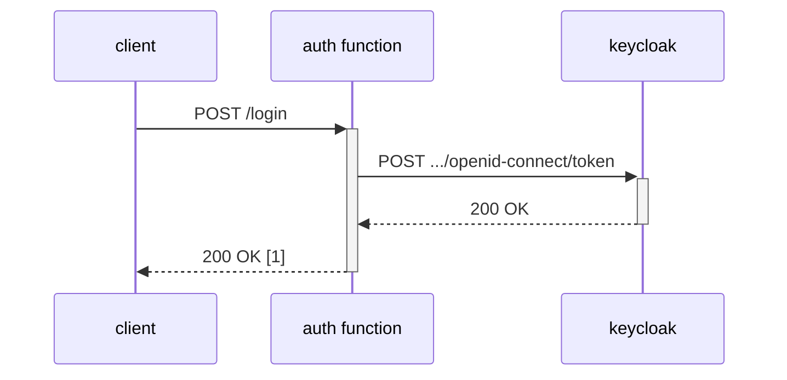
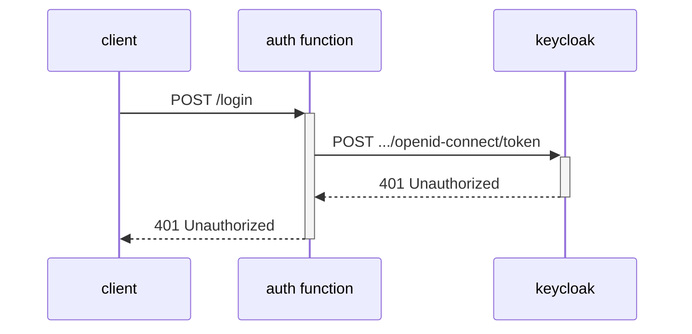
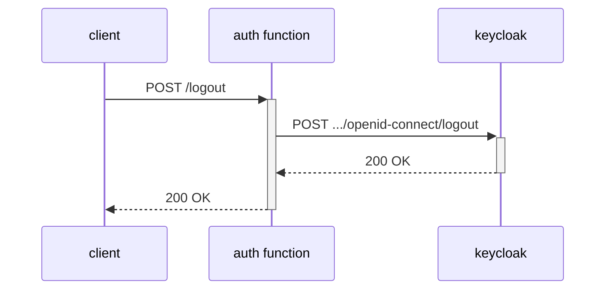
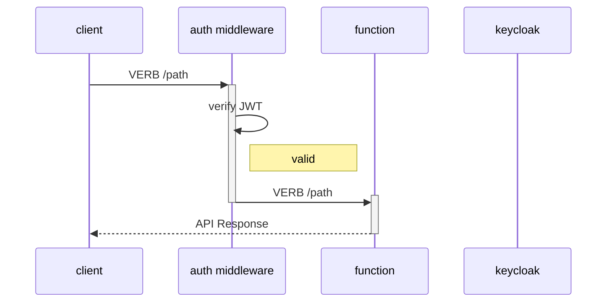
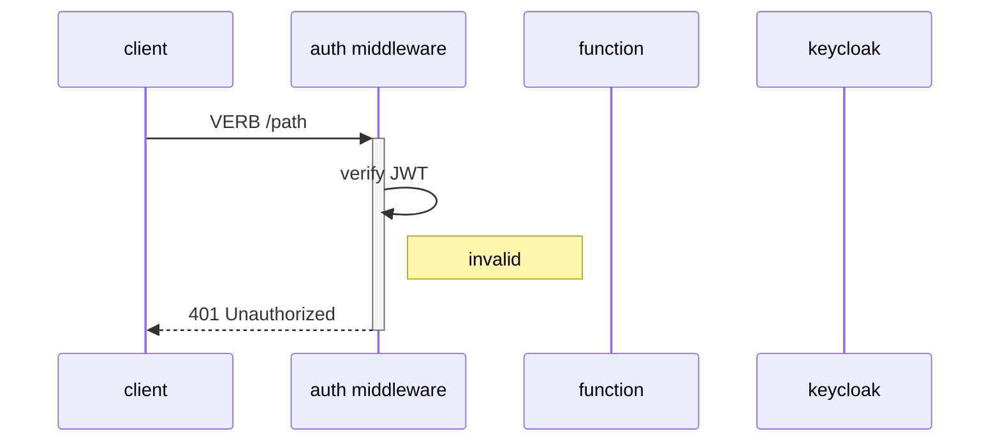
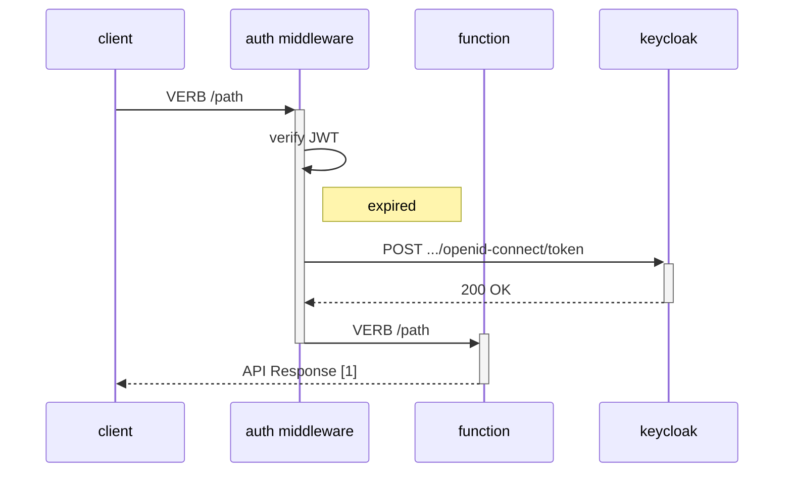
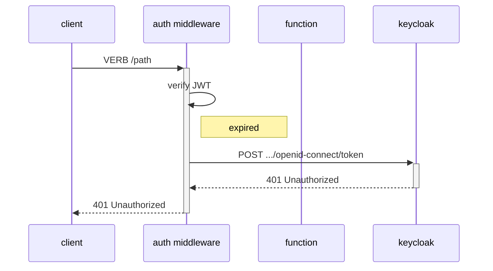

# Authentication Flow

[[_TOC_]]

## Login

### Happy Flow

### Unhappy Flow

## Logout

## Authenticated API Call

### Happy Flow

### Unhappy Flow

#### Invalid Token

#### Expired Token, Successful Refresh

Notes:
1. Includes updated `x-access-token` and `x-refresh-token` headers

#### Expired Token, Unsuccessful Refresh

